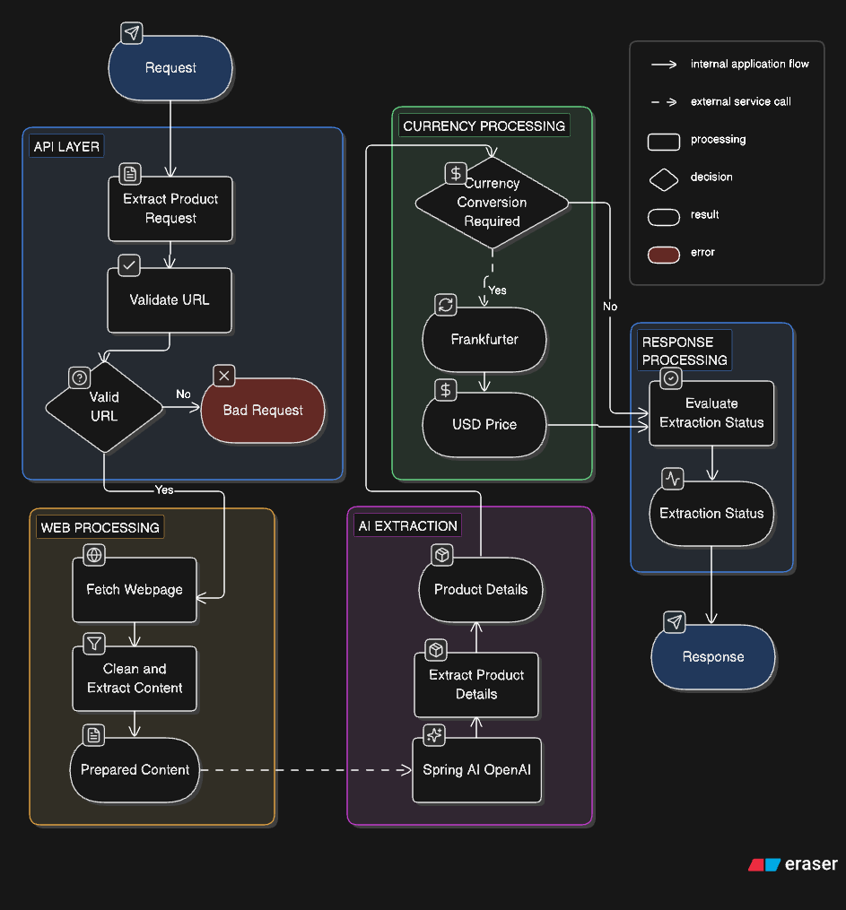

  

  AI powered product information extraction from any product URL.

  <a href="#1-project-overview">Overview</a> •
  <a href="#2-key-features">Features</a> •
  <a href="#3-architecture--system-flow">Architecture</a> •
  <a href="#4-tech-stack">Tech Stack</a> •
  <a href="#5-integration">Integration</a>

---

## 1. Project Overview

**url2Product AI** is a Spring Boot service that extracts structured product information from a product webpage using **web scraping, content processing, and LLM powered extraction**.

The goal is to turn an unstructured product URL into a predictable product object containing information such as:

- Product title
- Description
- Price
- Currency
- Product images
- Extraction status
- Source URL

### The Problem

Product pages have different HTML structures, schemas, price formats, and layouts, making traditional website specific scraping difficult to maintain.

`url2product-ai` combines **Jsoup** for webpage processing with **Spring AI + OpenAI** for flexible product extraction.

### How It Works

The API validates the URL, fetches and cleans the webpage, extracts product details using the LLM, optionally converts the price to USD via **Frankfurter**, and returns a standardized response with an extraction status.

---

## 2. Key Features

- **URL Validation** - Validates URLs before processing.
- **Webpage Fetching & Cleaning** - Fetches and cleans HTML using Jsoup.
- **Product Extraction** - Extracts title, description, price, currency, images, and source.
- **LLM Extraction** - Uses Spring AI + OpenAI for semantic extraction.
- **Price & Currency** - Preserves original values from the webpage.
- **Currency Conversion** - Optional USD conversion via Frankfurter.
- **Extraction Status** - Returns `SUCCESS`, `PARTIAL`, or `FAILED`.
- **Standardized API** - Consistent responses with centralized error handling.

---

## 3. Architecture / System Flow

The extraction pipeline follows a sequential processing flow:

  

## 4. Tech Stack

  

**Backend:** Java, Spring Boot, Maven, Spring AI, OpenAI

**Web Processing:** Jsoup - fetches, parses, and cleans webpage content before LLM extraction.

**Currency:** Frankfurter API - used for optional currency conversion to USD. Currency extraction and conversion are handled separately from the LLM.

  
  

**Demo Client:** React 19, TypeScript, Vite, Tailwind CSS, shadcn/base-ui

---

## 5. Integration

Want to integrate `url2product-ai` into your Spring Boot application?

**Read the integration guide:**  
https://bootarc.vercel.app/blog/Integrateurl2Product

### Non-AI Alternative

If you prefer a deterministic, non-LLM approach, check out **url2Product**:

https://github.com/DinethDilhara/url2product

It can be integrated into Spring Boot projects as a Maven dependency.

---

## 6. Limitations

Web scraping depends on the target website. Some sites may use **anti-bot protection, authentication, JavaScript rendering, or dynamic content**, which can prevent successful extraction.

LLM extraction may also return incomplete data. The API reports this through `SUCCESS`, `PARTIAL`, or `FAILED` statuses.

## 7. Demo

See `url2product-ai` in action:

<video src="./assets/url2product-ai-repo-demo.mp4" controls width="100%"></video>

https://github.com/user-attachments/assets/f8905e44-2505-4b7a-b11b-7849d32ec764

---

Built with 🤍 by **Dineth Dilhara**
